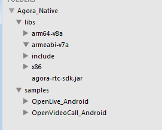
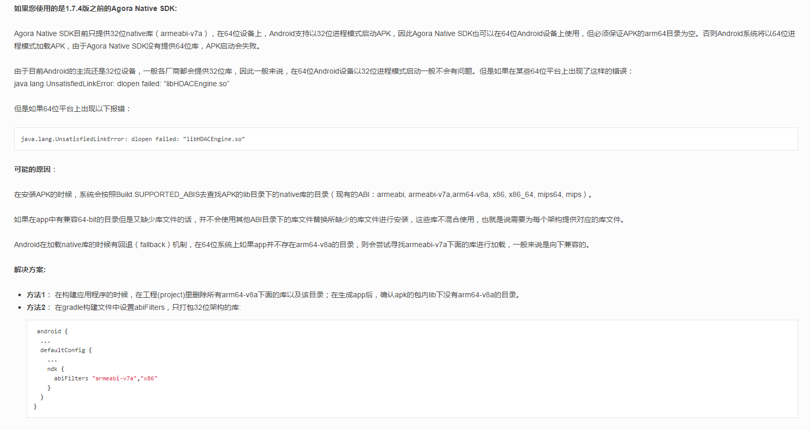
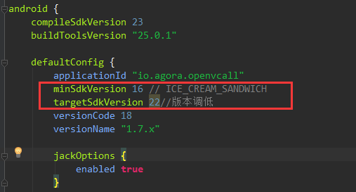

# ThirdPartyDemo
第三方接入演示项目
	对于第三方的接入对于熟练的人来说很简单。对于不熟悉的人才说，掌握了各大第三方官网的习惯，在接入的时候也不会有大问题。一般官网都会给出samples项目以供开发人员学习以及使用。那么第一步就是从samples开始。
--------
##agora.io声网SDK接入
###1.Demo的运行效果
a.按照官方文档的要求准备对应的环境
			-Android SDK API Level> = 16
			-Android Studio 2.0 或以上版本
			-支持语音和视频功能的真机
			-App要求Android 4.1或以上设备
			-ndk
b.下载下来的demo直接打开的目录结构如下：

c.使用AS打开项目
根据官方项目中预留的提示文件PLACEHOLDER
分别需要在
app/libs目录下存放agora-rtc-sdk.jar
main/libs下存放armeabi-v7a以及x86
所需要的文件可以去整个官方包的libs中去找。
sample项目中自带相关文件，也可以使用make project重新编译项目
生成的.so文件可以在app/build/intermediates/ndkBuild/debug/obj/local下面找到生成的文件
copy至main/libs目录下
d.run项目
运行成功后，程序可能出现崩溃，并报错如下
'java.lang.UnsatisfiedLinkError: dlopen failed: "libHDACEngine.so" text has doration'
此问题官方文档给出解决方案如图[图片不清晰可以放大查看或访问官网
http://docs.agora.io/cn/user_guide/FAQ/communication_faq.html]

但是，按照官方的解决方法解决后，依然报错，检查运行环境api是否大于

至此Demo就可以正常的run在模拟器上了=w=
####总结：问题基本上官方都会给出对应的解决方案，剩下的只需要自己细心就能搞定~
###2.演示接入代码效果

